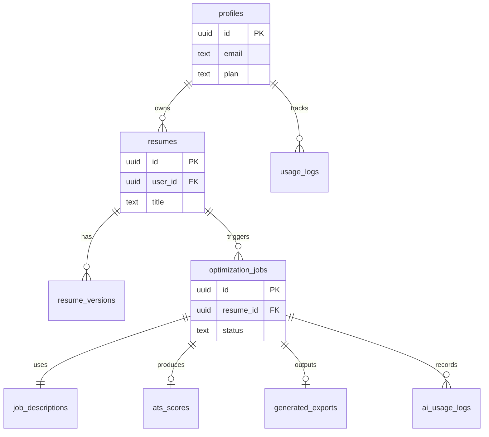

# Database Schema

PostgreSQL on **Supabase** with Row Level Security (RLS). All tables use `uuid` primary keys and `timestamptz` for timestamps.

---

## Entity Relationship Overview



---

## Tables

### `profiles`

Extends Supabase `auth.users`. Created via trigger on signup.

| Column | Type | Notes |
|--------|------|-------|
| `id` | `uuid` PK | FK → `auth.users(id)` ON DELETE CASCADE |
| `email` | `text` NOT NULL | Denormalized from auth |
| `full_name` | `text` | Optional |
| `avatar_url` | `text` | Optional |
| `plan` | `text` NOT NULL DEFAULT `'free'` | `free`, `pro`, `team` |
| `optimizations_used` | `int` NOT NULL DEFAULT 0 | Reset monthly via cron |
| `optimizations_limit` | `int` NOT NULL DEFAULT 3 | Plan-based |
| `created_at` | `timestamptz` | DEFAULT `now()` |
| `updated_at` | `timestamptz` | DEFAULT `now()` |

---

### `resumes`

Logical resume entity (one per uploaded document lineage).

| Column | Type | Notes |
|--------|------|-------|
| `id` | `uuid` PK | DEFAULT `gen_random_uuid()` |
| `user_id` | `uuid` NOT NULL | FK → `profiles(id)` |
| `title` | `text` NOT NULL | User-editable label |
| `source_filename` | `text` | Original name |
| `source_mime` | `text` | `application/pdf` or DOCX mime |
| `storage_path` | `text` | Path in `uploads` bucket |
| `status` | `text` NOT NULL DEFAULT `'active'` | `active`, `archived` |
| `created_at` | `timestamptz` | |
| `updated_at` | `timestamptz` | |

**Index:** `(user_id, created_at DESC)`

---

### `resume_versions`

Immutable snapshots of extracted and optimized content.

| Column | Type | Notes |
|--------|------|-------|
| `id` | `uuid` PK | |
| `resume_id` | `uuid` NOT NULL | FK → `resumes(id)` ON DELETE CASCADE |
| `version_type` | `text` NOT NULL | `original`, `optimized` |
| `raw_text` | `text` | Extracted plain text |
| `structured_content` | `jsonb` | Canonical resume schema (see below) |
| `extraction_metadata` | `jsonb` | Page count, warnings, parser version |
| `optimization_job_id` | `uuid` | NULL for original; FK for optimized |
| `created_at` | `timestamptz` | |

**Index:** `(resume_id, version_type, created_at DESC)`

---

### `job_descriptions`

Stored JD text and AI-parsed structure.

| Column | Type | Notes |
|--------|------|-------|
| `id` | `uuid` PK | |
| `user_id` | `uuid` NOT NULL | FK → `profiles(id)` |
| `raw_text` | `text` NOT NULL | Pasted JD |
| `content_hash` | `text` | SHA-256 for dedup/cache |
| `parsed_analysis` | `jsonb` | Claude output: skills, keywords, etc. |
| `created_at` | `timestamptz` | |

**Index:** `(user_id, content_hash)`

---

### `optimization_jobs`

Central async workflow record.

| Column | Type | Notes |
|--------|------|-------|
| `id` | `uuid` PK | |
| `user_id` | `uuid` NOT NULL | FK → `profiles(id)` |
| `resume_id` | `uuid` NOT NULL | FK → `resumes(id)` |
| `job_description_id` | `uuid` NOT NULL | FK → `job_descriptions(id)` |
| `status` | `text` NOT NULL DEFAULT `'pending'` | See state machine below |
| `progress` | `int` NOT NULL DEFAULT 0 | 0–100 |
| `current_step` | `text` | Human-readable step label |
| `error_code` | `text` | Machine-readable on failure |
| `error_message` | `text` | Safe user-facing message |
| `idempotency_key` | `text` UNIQUE | Client-supplied |
| `template_id` | `text` NOT NULL DEFAULT `'ats_modern'` | LaTeX template key |
| `started_at` | `timestamptz` | |
| `completed_at` | `timestamptz` | |
| `created_at` | `timestamptz` | |

**Status enum:** `pending` → `extracting` → `analyzing_jd` → `optimizing` → `scoring` → `rendering_pdf` → `completed` | `failed` | `cancelled`

**Indexes:** `(user_id, created_at DESC)`, `(status)` WHERE `status` NOT IN (`completed`, `failed`, `cancelled`)

---

### `ats_scores`

One score record per completed optimization (latest wins if re-run).

| Column | Type | Notes |
|--------|------|-------|
| `id` | `uuid` PK | |
| `optimization_job_id` | `uuid` NOT NULL UNIQUE | FK → `optimization_jobs(id)` |
| `overall_score` | `numeric(5,2)` | 0.00–100.00 |
| `keyword_score` | `numeric(5,2)` | |
| `formatting_score` | `numeric(5,2)` | |
| `structure_score` | `numeric(5,2)` | |
| `breakdown` | `jsonb` | Detailed rubric |
| `matched_keywords` | `text[]` | |
| `missing_keywords` | `text[]` | |
| `suggestions` | `jsonb` | Array of `{priority, message}` |
| `created_at` | `timestamptz` | |

---

### `generated_exports`

PDF (and optional `.tex`) artifacts.

| Column | Type | Notes |
|--------|------|-------|
| `id` | `uuid` PK | |
| `optimization_job_id` | `uuid` NOT NULL UNIQUE | FK |
| `pdf_storage_path` | `text` NOT NULL | `generated` bucket |
| `tex_storage_path` | `text` | Optional debug |
| `file_size_bytes` | `bigint` | |
| `page_count` | `int` | |
| `compile_log` | `text` | Truncated on success; full on failure |
| `created_at` | `timestamptz` | |

---

### `usage_logs`

Metering for billing and limits.

| Column | Type | Notes |
|--------|------|-------|
| `id` | `uuid` PK | |
| `user_id` | `uuid` NOT NULL | |
| `event_type` | `text` | `optimization_started`, `optimization_completed`, `download` |
| `optimization_job_id` | `uuid` | Nullable |
| `metadata` | `jsonb` | |
| `created_at` | `timestamptz` | |

**Index:** `(user_id, created_at DESC)`

---

### `ai_usage_logs`

Cost and observability for Claude calls.

| Column | Type | Notes |
|--------|------|-------|
| `id` | `uuid` PK | |
| `optimization_job_id` | `uuid` | FK |
| `operation` | `text` | `jd_analyze`, `optimize`, `ats_score` |
| `model` | `text` | e.g. `claude-sonnet-4-20250514` |
| `input_tokens` | `int` | |
| `output_tokens` | `int` | |
| `latency_ms` | `int` | |
| `created_at` | `timestamptz` | |

---

## Structured Resume JSON Schema (`structured_content`)

Canonical format consumed by optimizer and LaTeX templates.

```json
{
  "contact": {
    "name": "string",
    "email": "string",
    "phone": "string",
    "location": "string",
    "linkedin": "string",
    "github": "string"
  },
  "summary": "string",
  "experience": [
    {
      "company": "string",
      "title": "string",
      "location": "string",
      "start_date": "YYYY-MM",
      "end_date": "YYYY-MM | present",
      "bullets": ["string"]
    }
  ],
  "education": [
    {
      "institution": "string",
      "degree": "string",
      "graduation_date": "YYYY-MM",
      "details": ["string"]
    }
  ],
  "skills": {
    "technical": ["string"],
    "soft": ["string"]
  },
  "certifications": ["string"],
  "projects": [
    {
      "name": "string",
      "description": "string",
      "technologies": ["string"]
    }
  ]
}
```

---

## Row Level Security Policies

| Table | Policy |
|-------|--------|
| `profiles` | Users SELECT/UPDATE own row (`auth.uid() = id`) |
| `resumes` | CRUD where `user_id = auth.uid()` |
| `resume_versions` | Access via join: resume owned by user |
| `job_descriptions` | CRUD where `user_id = auth.uid()` |
| `optimization_jobs` | CRUD where `user_id = auth.uid()` |
| `ats_scores` | SELECT via optimization owned by user |
| `generated_exports` | SELECT via optimization owned by user |
| `usage_logs` | INSERT/SELECT own rows only |
| `ai_usage_logs` | No direct client access (service role only) |

**Service role:** FastAPI worker uses `SUPABASE_SERVICE_ROLE_KEY` for job updates and storage; never exposed to browser.

---

## Storage Policies

**Bucket `uploads`**

- Path pattern: `{user_id}/{resume_id}/original.{ext}`
- INSERT/SELECT: `auth.uid()::text = (storage.foldername(name))[1]`

**Bucket `generated`**

- Path pattern: `{user_id}/{optimization_job_id}/resume.pdf`
- SELECT: same folder rule; downloads via signed URL from API

**Bucket `temp`**

- Service role only; lifecycle rule deletes objects older than 7 days

---

## Triggers & Functions

| Name | Purpose |
|------|---------|
| `handle_new_user()` | Insert `profiles` on `auth.users` insert |
| `set_updated_at()` | Bump `updated_at` on row change |
| `increment_optimizations_used()` | On job `completed`, increment profile counter |
| `reset_monthly_usage()` | pg_cron: reset `optimizations_used` on 1st |

---

## Migration File

SQL migration lives at:

`supabase/migrations/20250526000000_initial_schema.sql`

Apply with:

```bash
supabase db push
# or locally
supabase db reset
```
