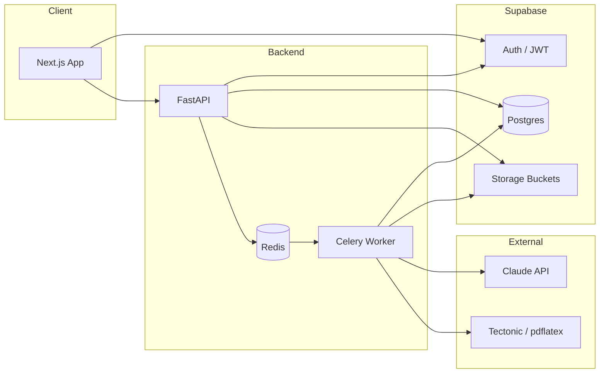
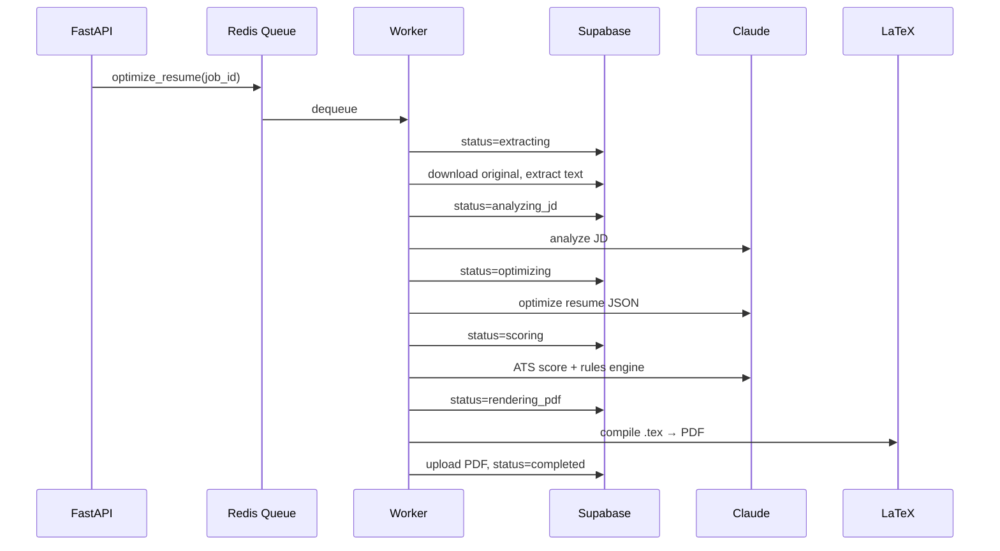

# API Architecture

**FastAPI** is the sole business-logic backend. **Next.js** talks to Supabase Auth directly and calls FastAPI with the user's JWT. Long-running work runs in a **background worker** (Celery + Redis).

---

## High-Level Topology



---

## Authentication Flow

1. User signs in via Supabase (email/OAuth) in Next.js.
2. Browser holds session; server components use cookie-based Supabase client.
3. Client calls FastAPI with `Authorization: Bearer <access_token>`.
4. FastAPI validates JWT using Supabase JWKS (`/.well-known/jwks.json`) or shared JWT secret.
5. `sub` claim maps to `user_id` for all repository queries.

**Unauthorized:** `401` with `{ "error": "unauthorized" }`  
**Forbidden (wrong resource owner):** `403`

---

## API Versioning & Base URL

| Environment | Base URL |
|-------------|----------|
| Local | `http://localhost:8000/api/v1` |
| Production | `https://api.resumeboost.app/api/v1` |

OpenAPI docs: `/api/v1/docs` (disabled in production or behind admin flag).

---

## Endpoints

### Health

| Method | Path | Auth | Description |
|--------|------|------|-------------|
| GET | `/health` | No | Liveness |
| GET | `/health/ready` | No | DB + Redis connectivity |

---

### Uploads

| Method | Path | Auth | Description |
|--------|------|------|-------------|
| POST | `/uploads/init` | Yes | Create `resume` row; return presigned upload URL |
| POST | `/uploads/{resume_id}/complete` | Yes | Confirm upload; enqueue extraction |
| GET | `/uploads/{resume_id}/status` | Yes | Extraction status + preview text |

#### `POST /uploads/init`

**Request**

```json
{
  "filename": "john_doe_resume.pdf",
  "mime_type": "application/pdf",
  "file_size_bytes": 245000
}
```

**Response `201`**

```json
{
  "resume_id": "uuid",
  "upload_url": "https://...supabase.co/storage/v1/...",
  "upload_token": "optional-if-using-tus",
  "expires_at": "2025-05-26T12:00:00Z"
}
```

**Validation:** Max 10 MB; allowed MIME: `application/pdf`, `application/vnd.openxmlformats-officedocument.wordprocessingml.document`.

---

### Resumes

| Method | Path | Auth | Description |
|--------|------|------|-------------|
| GET | `/resumes` | Yes | Paginated list |
| GET | `/resumes/{resume_id}` | Yes | Detail + latest version |
| PATCH | `/resumes/{resume_id}` | Yes | Update title / archive |
| DELETE | `/resumes/{resume_id}` | Yes | Soft-delete (archive) |

---

### Optimizations

| Method | Path | Auth | Description |
|--------|------|------|-------------|
| POST | `/optimizations` | Yes | Start full pipeline (JD + resume) |
| GET | `/optimizations` | Yes | List jobs for user |
| GET | `/optimizations/{job_id}` | Yes | Status + partial results |
| GET | `/optimizations/{job_id}/result` | Yes | Full result when completed |
| POST | `/optimizations/{job_id}/cancel` | Yes | Cancel if not terminal |

#### `POST /optimizations`

**Request**

```json
{
  "resume_id": "uuid",
  "job_description": "Full pasted JD text...",
  "template_id": "ats_modern",
  "idempotency_key": "client-generated-uuid"
}
```

**Response `202`**

```json
{
  "job_id": "uuid",
  "status": "pending",
  "status_url": "/api/v1/optimizations/{job_id}"
}
```

**Side effects:**

1. Check `profiles.optimizations_used < optimizations_limit`.
2. Insert `job_descriptions` (or reuse by `content_hash`).
3. Insert `optimization_jobs` with `status=pending`.
4. Enqueue Celery task `optimize_resume(job_id)`.
5. Insert `usage_logs` event.

---

### Exports (PDF Download)

| Method | Path | Auth | Description |
|--------|------|------|-------------|
| GET | `/exports/{job_id}/download` | Yes | Redirect or JSON with signed URL |
| GET | `/exports/{job_id}/metadata` | Yes | File size, page count |

#### `GET /exports/{job_id}/download`

**Response `200`**

```json
{
  "download_url": "https://...signed...",
  "expires_in_seconds": 3600,
  "filename": "John_Doe_Optimized_Resume.pdf"
}
```

Frontend opens URL in new tab or triggers `download` attribute.

---

## Background Worker Pipeline

Single Celery task orchestrates steps; updates `optimization_jobs` after each.



### Step Details

| Step | Service | Output |
|------|---------|--------|
| Extract | `pdf_extractor` / `docx_extractor` | `resume_versions` (original), `raw_text` |
| Analyze JD | `jd_analyzer` | `job_descriptions.parsed_analysis` |
| Optimize | `resume_optimizer` | `resume_versions` (optimized), `structured_content` |
| Score | `ats_scorer` | `ats_scores` row |
| Render | `template_engine` + `compiler` | `generated_exports` |

**Retries:** Transient Claude/network errors: max 3 retries with exponential backoff. LaTeX failure: no retry; mark `failed` with `error_code=latex_compile_error`.

**Timeouts:** Job hard limit 10 minutes; LaTeX subprocess 60 seconds.

---

## Claude Integration

| Operation | Model | Max tokens | Temperature |
|-----------|-------|------------|-------------|
| JD analysis | Sonnet | 4k out | 0 |
| Resume optimize | Sonnet | 8k out | 0.3 |
| ATS narrative suggestions | Haiku | 2k out | 0 |

**Prompt storage:** `apps/api/app/services/ai/prompts/*.md` versioned in git.

**Structured outputs:** Require JSON mode / tool use; validate with Pydantic before DB write.

**PII:** Do not log full resume text; log token counts and job IDs only.

---

## Error Response Format

```json
{
  "error": {
    "code": "OPTIMIZATION_LIMIT_REACHED",
    "message": "You have used all optimizations for this month.",
    "details": {}
  }
}
```

| HTTP | Codes |
|------|-------|
| 400 | `INVALID_FILE`, `INVALID_MIME`, `JD_TOO_SHORT` |
| 401 | `UNAUTHORIZED` |
| 403 | `FORBIDDEN` |
| 404 | `NOT_FOUND` |
| 409 | `IDEMPOTENCY_CONFLICT` |
| 422 | Validation errors (FastAPI default) |
| 429 | `RATE_LIMITED` |
| 500 | `INTERNAL_ERROR` |
| 503 | `WORKER_UNAVAILABLE` |

---

## Rate Limiting

| Scope | Limit |
|-------|-------|
| Per user | 10 requests/min on `POST /optimizations` |
| Per IP (auth routes on web) | Handled by Supabase |
| Claude | Enforced by plan `optimizations_limit` |

Implementation: Redis sliding window middleware in FastAPI.

---

## Next.js ↔ API Integration

```typescript
// apps/web/src/lib/api-client.ts
export async function apiFetch<T>(
  path: string,
  options?: RequestInit
): Promise<T> {
  const supabase = createClient();
  const { data: { session } } = await supabase.auth.getSession();
  const res = await fetch(`${process.env.NEXT_PUBLIC_API_URL}/api/v1${path}`, {
    ...options,
    headers: {
      'Content-Type': 'application/json',
      Authorization: `Bearer ${session?.access_token}`,
      ...options?.headers,
    },
  });
  if (!res.ok) throw new ApiError(await res.json());
  return res.json();
}
```

**Polling:** `GET /optimizations/{job_id}` every 2s until terminal state, or SSE endpoint (post-MVP):

`GET /optimizations/{job_id}/stream` → `text/event-stream`

---

## CORS

```python
CORSMINS_ORIGINS = [
    "http://localhost:3000",
    "https://app.resumeboost.app",
]
```

Credentials: not required (Bearer token only).

---

## Deployment Units

| Service | Port | Scaling |
|---------|------|---------|
| FastAPI | 8000 | Horizontal; stateless |
| Celery worker | — | Scale on queue depth |
| Redis | 6379 | Managed (Upstash / ElastiCache) |
| LaTeX | — | Run inside worker container |

**Note:** LaTeX requires ~500MB–1GB image; keep worker separate from API container for faster API deploys.

---

## Security Checklist

- [ ] Validate JWT on every protected route
- [ ] Service role key only in worker + API server env (never client)
- [ ] Presigned URLs expire ≤ 1 hour
- [ ] Sanitize filenames; reject path traversal
- [ ] Escape LaTeX special characters in template engine
- [ ] Run LaTeX in subprocess with no network, limited CPU/memory
- [ ] Input size limits on JD (e.g. 15k chars) and resume text
