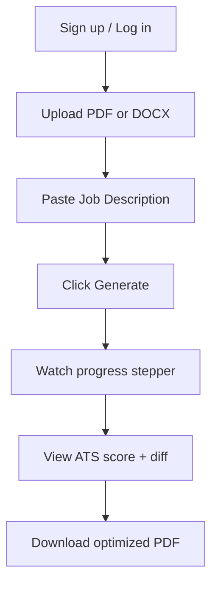
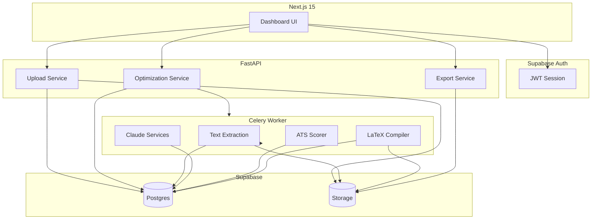
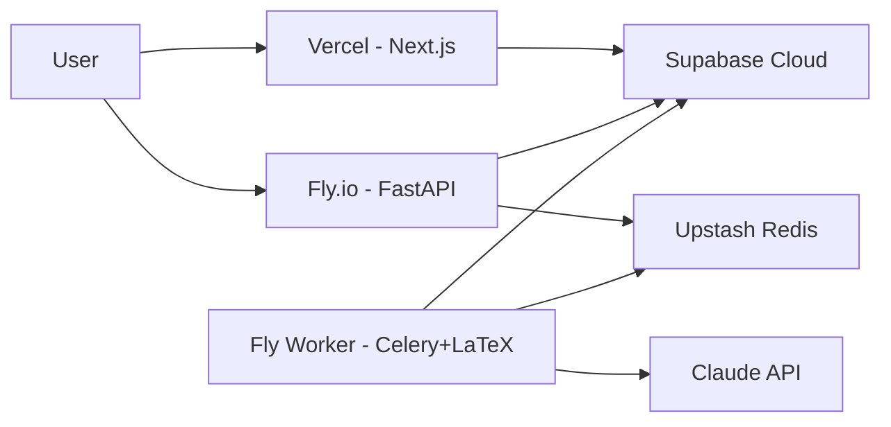

# System Architecture

End-to-end design for ResumeBoost: upload → AI optimization → ATS score → LaTeX PDF → download.

---

## User Journey (Happy Path)

---

## Component Responsibilities

| Component | Responsibility | Does NOT |
|-----------|----------------|----------|
| **Next.js** | UI, auth session, file picker, polling, download UX | Run Claude, compile LaTeX, store secrets |
| **FastAPI** | AuthZ, orchestration, presigned URLs, job creation | Block on 2+ min AI work (delegates to worker) |
| **Celery worker** | Extract, AI, score, LaTeX, storage uploads | Serve HTTP to browsers |
| **Supabase Auth** | Identity, JWT | Business logic |
| **Supabase DB** | Source of truth | File bytes |
| **Supabase Storage** | Blobs (original + PDF) | Text search |
| **Claude API** | JD analysis, rewrite, scoring narrative | Direct client access |
| **LaTeX (Tectonic)** | ATS-safe PDF layout | Parse uploaded files |

---

## Data Flow Diagram

---

## ATS Scoring Model (Hybrid)

Combines **deterministic rules** (fast, explainable) with **Claude-assisted gap analysis** (nuanced).

| Dimension | Weight | Method |
|-----------|--------|--------|
| Keyword match | 40% | Tokenize JD keywords vs resume; stem/fuzzy match |
| Section structure | 25% | Required sections present (Experience, Skills, etc.) |
| Formatting safety | 20% | No tables/images in template; standard headings |
| Content quality | 15% | Claude rates bullet impact vs JD requirements |

**Output:** `overall_score` plus `suggestions[]` with `priority: high | medium | low`.

---

## LaTeX PDF Strategy

**Why LaTeX:** Precise typography, single-column ATS-safe layouts, no hidden text boxes.

**Pipeline:**

1. Map `structured_content` JSON → Jinja2 template (`ats_modern.tex.j2`).
2. Escape `%`, `&`, `_`, `#`, `$` in user content.
3. Write to temp directory; run `tectonic resume.tex` (preferred over full TeX Live for image size).
4. Validate PDF (page count > 0, file size < 5MB).
5. Upload to `generated/{user_id}/{job_id}/resume.pdf`.

**Template rules for ATS:**

- Standard section headings: Experience, Education, Skills
- No headers/footers with critical info only in margin
- Selectable text (no rasterized pages)
- Simple bullet lists (`itemize`)

---

## Frontend Architecture (Next.js 15)

| Concern | Approach |
|---------|----------|
| Routing | App Router with route groups `(marketing)`, `(auth)`, `(dashboard)` |
| Styling | Tailwind + shadcn/ui design tokens |
| State | Server Components for lists; client state for wizard + polling |
| Forms | react-hook-form + zod |
| Auth guard | Middleware checks Supabase session for `/dashboard/*` |
| File upload | Direct to Supabase Storage via presigned URL OR tus (v2) |

### Key Screens

1. **Landing** — Value prop, CTA, pricing teaser
2. **New optimization wizard** — Steps: Upload → JD → Generate
3. **Job progress** — Stepper mapped to `optimization_jobs.current_step`
4. **Results** — ATS ring, keyword chips, side-by-side diff, download CTA

---

## Observability

| Signal | Tool |
|--------|------|
| API errors | Sentry (FastAPI integration) |
| Worker failures | Sentry + Celery task binding |
| Metrics | Prometheus counters: jobs_completed, latex_failures, claude_latency |
| Logs | Structured JSON (job_id, user_id hash) |
| Uptime | Better Stack / Pingdom on `/health` |

---

## Infrastructure (Production)

| Service | Provider |
|---------|----------|
| Frontend | Vercel |
| API + Worker | Fly.io machines (or Railway) |
| Database, Auth, Storage | Supabase Pro |
| Queue | Upstash Redis |
| DNS | Cloudflare |

---

## Cost Drivers (Planning)

| Resource | Driver |
|----------|--------|
| Claude | ~3 calls × tokens per optimization |
| Storage | Original + PDF per job (~2–5 MB/user/month avg) |
| Worker CPU | LaTeX compile ~5–15s per job |
| Supabase | Egress on PDF download |

**Mitigation:** Plan limits, JD hash caching, Haiku for lightweight scoring passes.

---

## Compliance & Privacy (Baseline)

- Store only data needed for service; allow account + data deletion
- Privacy policy: resumes processed by Anthropic API (subprocessor)
- Encrypt at rest (Supabase default); TLS in transit
- GDPR: export user data endpoint (post-MVP)
- Retention: auto-delete `temp` bucket; optional archive policy on `uploads` after 90 days

---

## Definition of Done (MVP)

- [ ] Authenticated user completes upload → download in one session
- [ ] ATS score displayed with ≥ 3 actionable suggestions
- [ ] Generated PDF passes manual copy-paste test (text selectable)
- [ ] Failed jobs show recoverable error message
- [ ] Mobile-responsive wizard and results page
- [ ] RLS verified: user A cannot access user B's files or jobs
